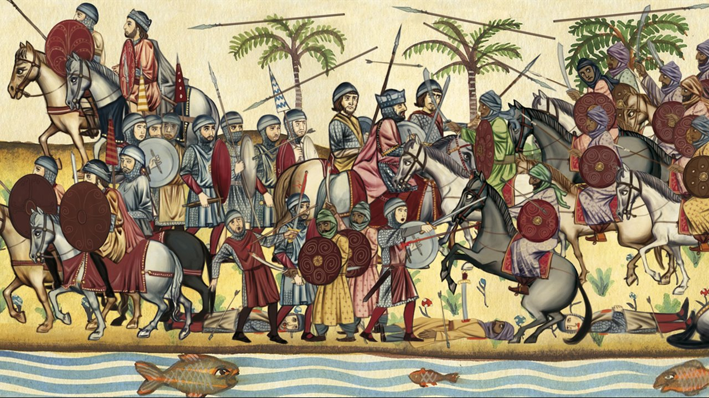

# Visigodos

Los visigodos fueron una rama de los pueblos godos, que a su vez pertenecen a los pueblos germánicos orientales, llamados pueblos bárbaros, y que vivieron dentro del Imperio romano durante la antigüedad tardía.

## Indice

1. [Época](Epoca.md)
2. [Arquitectura](Arquitectura.md)
3. [Obras](Obras.md)

## Referencias
[Instituto Nacional Geografico](https://historia.nationalgeographic.com.es/temas/visigodos)
